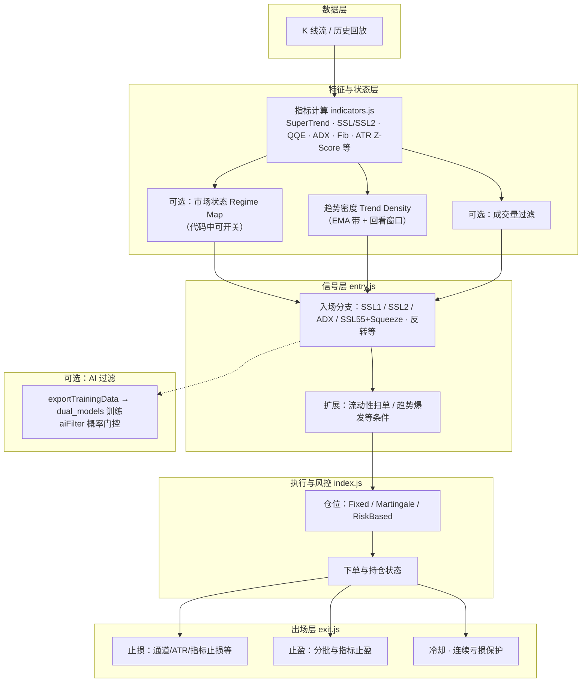

# trading-bot

基于 **Node.js** 的加密货币量化交易与回测仓库：策略逻辑与执行框架解耦，指标与工具集中在 `utils/`，策略以独立目录形式维护。默认连接 **币安 U 本位合约** API；本地回测通过 `tests/nodeServer/wsServer.js` 按 K 线流推送历史数据。

---

## 仓库结构（总览）

```text
trading-bot/
├── strategies/                    # 策略包（每个子目录 = 一套可运行策略）
│   ├── CTA-RegimeMap/             # 【主策略】ETH CTA + SuperTrend/SSL/QQE 体系（见下文）
│   ├── CTA-RegimeMap-atrMoveSL/   # 变体：profitR 分档移动止损等
│   ├── superTrend_SSL_qqeMod/    # 较早的 superTrend+SSL+QQE 组织方式
│   ├── multWaveTrend_fvg/        # 多周期 WaveTrend + FVG 等实验策略
│   └── …
├── utils/                         # 指标与通用函数（ADX、ATR、EMA、RSI、SuperTrend、SSL、QQE…）
├── tests/
│   ├── nodeServer/                # 本地 HTTP/WS：回放 tests/source 下 K 线，驱动策略回测
│   ├── source/                    # 历史 K 线数据（*.js 导出 kLineData，体积大，常用 Git LFS）
│   └── test-*.js                  # 各策略/周期的离线测试脚本
├── tools/getKlines/               # 从交易所拉取并合并 K 线写入 tests/source
├── models/                        # 机器学习侧（如 DNN 优化实验）
├── data/                          # 运行期或可视化用的数据导出（视策略配置）
├── tradingviePinScript/           # TradingView Pine 脚本参考
├── temp/                          # 本地临时脚本/配置（不保证稳定）
├── start.sh / stop.sh             # 部署用脚本示例
├── analysisWinRate.ps1            # 日志胜率分析示例
├── package.json / pnpm-lock.yaml
└── README.md
```

### `strategies/CTA-RegimeMap/`（策略目录展开）

```text
CTA-RegimeMap/
├── index.js              # 主进程：WS、下单、回测循环、kaiDanDaJi → judgeAndTrading
├── config.js             # 交易对、周期、风控、止盈止损、AI 开关等
├── entry.js              # 交易方向、入场条件（SSL/SSL2/ADX、SSL55+Squeeze、反转等）
├── exit.js               # 止损、分批止盈、冷却、平仓逻辑
├── indicators.js         # 指标更新管线（与 K 线同步 push/shift）
├── logs.js               # 可视化日志收集（可选）
├── exportTrainingData.js # Step1：回测结束导出 ML 训练 JSON
├── aiFilter.js           # Step3：m2cgen 双模型概率过滤（可选）
├── ai/
│   └── dual_models/      # Python：双模型训练 + output/score_*.js
├── training-data/        # ml-training-data-*.json（导出结果）
├── test/                 # 本地可视化：app.js + data 日志
├── logs/ / errors/
└── md/
    ├── 策略描述-superTrend_SSL_qqeMod.md   # 多空规则细则
    ├── 建议总结.md                         # 改造路线与模块说明（含策略结构）
    └── AI接入-*.md                         # 训练数据与 AI 接入说明
```

---

## 核心策略：`CTA-RegimeMap`（superTrend_SSL_qqeMod）

**定位**：以 **SuperTrend** 定大趋势，**SSL / SSL2** 定通道与斜率，**QQE MOD** 作动量与拐头过滤，配合 **ADX**、**Fib**、可选 **SSL55 + Squeeze Box** 等多路入场；**exit** 侧实现止损、分批止盈（SuperTrend/Fib/QQE 等可配）、**波动率相关止损**、冷却与连续亏损保护。适用于 **ETH** 等品种，周期上文档建议 **30m**（实现上可按 `config.klineStage` 如 `30m` 回测）。

### 量化流水线（逻辑架构）

其中「市场状态 Regime」「成交量过滤」等模块在工程里可能阶段性关闭或注释，以仓库内 `entry.js` / `config.js` 为准。



**文字版（与上图对应）**

| 阶段 | 内容 |
|------|------|
| 数据层 | WebSocket 或本地 WS 推送的 OHLCV；`maxKLinelen` 滑动窗口 |
| 特征层 | SuperTrend、SSL/SSL2、QQE MOD、ADX、Fib、Swing、ATR Z-Score 等；可选 Regime / 趋势密度 / 成交量 |
| 信号层 | `judgeTradingDirection` 与 `calculateTradingSignal`：多路 section 合成方向与止损止盈价 |
| 执行层 | `judgeAndTrading` → 下单；可选 **AI 过滤**（`config.enableAiFilter`） |
| 出场层 | 止损、分批止盈、保本、冷却机制 |

更细的**多空条件、参数名**见：`strategies/CTA-RegimeMap/md/策略描述-superTrend_SSL_qqeMod.md`。

---

## 技术栈与运行依赖

- **运行时**：Node.js（策略主程序）
- **交易所**：币安合约 API（`config.isTest` / `isTestLocal` 区分实盘与本地回放）
- **本地回测**：`tests/nodeServer/wsServer.js` 读取 `tests/source/<symbol>-<interval>.js` 中的 `kLineData` 逐根推送
- **可选**：Python 3（`CTA-RegimeMap/ai/dual_models` 双模型训练）、MongoDB 等仅在部分历史脚本中出现，**以当前策略 `config` 与入口为准**

### 环境变量（示例）

在项目根目录创建 `.env`（勿提交密钥）：

```env
BINANCE_API_KEY=your_key
BINANCE_API_SECRET=your_secret
```

其他变量以各策略目录说明为准。

### 本地回放 CTA-RegimeMap（简要）

1. 准备 K 线：`tests/source/` 下存在对应 `ethusdt-30m.js` 等（或通过 `tools/getKlines` 生成）。
2. 启动推流服务：`node tests/nodeServer/wsServer.js`（注意该文件内 `startTime` / `endTime` 与交易对）。
3. 启动策略：`node strategies/CTA-RegimeMap/index.js`（`config.js` 中 `isTestLocal: true` 连本地 WS）。

训练数据与 AI：`strategies/CTA-RegimeMap/md/AI接入-step1.md` 等。

---

## 其他策略与遗留说明

仓库中 `strategies/` 下其他目录、 `temp/` 等为历史K线数据回测

`tests/bestSolution` 最佳参数挖掘会过拟合，不建议

部分文档与 `CTA-RegimeMap` 主文档不同步时以**各目录内 `config.js` 与代码为准。

---

## 法律声明

本项目仅供学习与研究。加密货币交易风险极高，可能造成本金全部损失。作者与贡献者不对使用本仓库产生的任何盈亏或法律责任负责。使用即表示你已阅读并同意自担风险；请遵守所在地法律法规及交易所条款。
